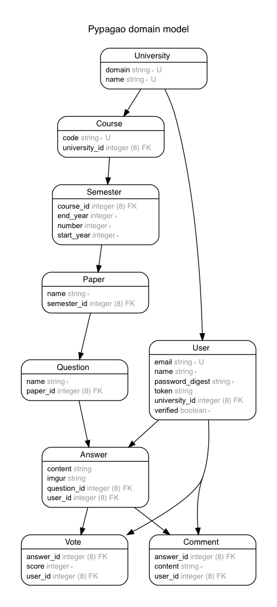

# PYPagao

A website providing crowdsourced solution for past year papers.

[](https://travis-ci.org/turbocharged-potato/pypagao) [](https://coveralls.io/github/turbocharged-potato/pypagao?branch=master) [](https://codeclimate.com/github/turbocharged-potato/pypagao/maintainability)

## Entity-Relationship Diagram


### Generate ERD
To generate the current Entity-Relationship Diagram, install `graphviz` (`sudo apt install graphviz` or `brew install graphviz`), then run `rake generate_erd`. This is also run as a post-migration hook (i.e. after `bin/rails db:migrate`)

## Installation
Make sure you have Ruby 2.5.0, Bundler, and PostgreSQL 9.6 installed. Adjust the content of `database.yml` and `.env`

```bash
cp config/database.yml.example config/database.yml
cp .env.default .env
bundle install
bin/rails db:setup
bin/rails server
```
